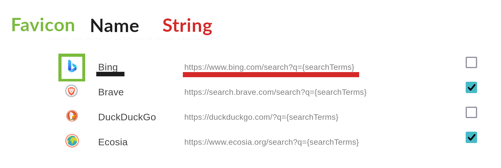

# Search Choices Contributing Guide

To submit a Search Choice can either open an Issue, for which there will be a set of boxes to fill out, or you can submit a Pull Request. If you are submitting a Pull Request then please look at the INSERT WHERE THIS WILL BE which contains ```FILE``` file formats as a reference guide.

### The following items will be required in order to submit a Search Choice:
- the name of the Search Choice, it is best here to just use the brand or domain name of the website in question
- the search string which will be used to pass a query from Mojeek to the Choice i.e. ```https://www.bing.com/search?q={searchTerms}```
- a favicon for the Search Choice, which will appear to the left of its name in Preferences
- a category for the Search Choice; these will build out as this repository becomes more used



## Criteria for Acceptance
In order to be a candidate for Search Choices, a Choice must:
- not replicate like-for-like the functionality of a Search Choice already in the library
- have a name which is clear and not misleading, or representing a value judgement
- have a functioning search string
- not search across x-rated adult content, or other content which would not be suitable to send your average Mojeek user to (i.e. gore, violence, scams)

**This list is not necessarily comprehensive, and will be revisited as the Library grows.** 
