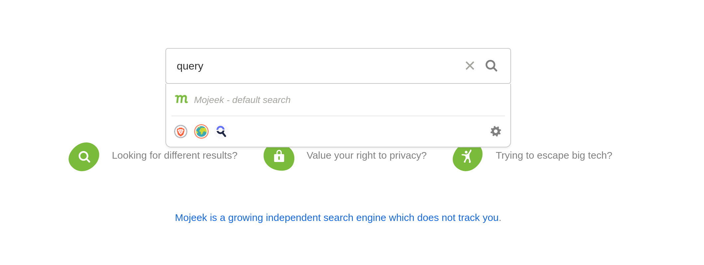

# FAQS

**What are Search Choices for?**  

Search Choices are pathways from the Mojeek search engine to other search providers, be they search engines (Mojeek, Google, Bing), metasearch engines (DuckDuckGo, Ecosia, Startpage), or specific resource searches (IMDb, Indeed).

From the Mojeek Search Engine Results Pages you can:

- repeat your search for a query on another search engine using the buttons you can enable in the search bar, or
- repeat your search for a query on another search engine using the buttons at the bottom of the results page.

**How do I submit without a Github account?**  

Github and other similar developer platforms can be very useful for this kind of collaborative work, but we understand that they are not for everyone. If you think that a search provider should be available via Mojeek, please get in contact via the [contact page](https://www.mojeek.com/about/contact) or [Community](https://community.mojeek.com/).

**Can I use Search Choices like !bangs?**

Search Choices operate similarly to bangs, but in their standard implementation they sit at the bottom of the Results Page, meaning you can repeat your searches after scrolling through results. You can enable in [Preferences](https://www.mojeek.com/preferences) the *Search Choice Bar* if you'd prefer to have these options available to you when typing in a query. 



**How can I use Search Choices?**

You can use Search Choices to hop from Mojeek to other search providers, adding to the diversity of sources that you have available to you; you can also use them to easily compare results between Mojeek and other providers.

**How can I find a favicon?**

Many search providers will have their favicon at /favicon.ico; for example both [Mojeek](https://www.mojeek.com/favicon.ico) and [Google](https://www.google.com/favicon.ico) provide their favourite icon in this way. If you have any issues finding this then please get in contact via the [contact page](https://www.mojeek.com/about/contact) or [Community](https://community.mojeek.com/) and we'll do our best to help you out.

**How can I find a search string?**

If you perform a search using the search provider you wish to add, the search string should appear appended to the URL. For example if you search for ```query``` on IMDb the resulting URL is ```https://www.imdb.com/find/?q=query```; you then simply need to replace your search term with {searchTerms} in order to make it ready for submission. If the URL contains other paramters such as ```&device=iPhone``` then please remove these before submitting. 

**What is unlikely to be accepted?**

Search Choices should not replicate like-for-like the functionality of a Search Choice already in the library. They should also not have a name which is clear and not misleading, or representing a value judgement. They need to have a functioning search string which Mojeek can send queries to, and will not be accepted if they search across x-rated adult content, or other content which would not be suitable to send your average Mojeek user to (i.e. gore, violence, scams).
