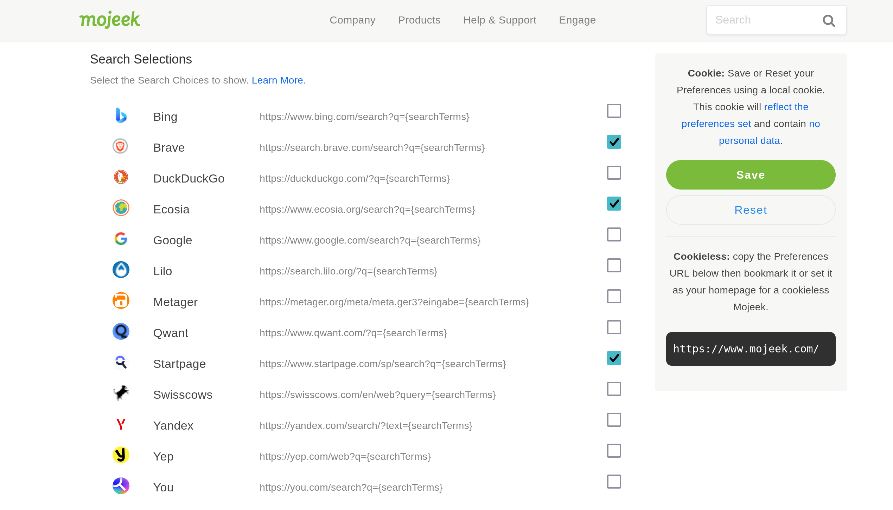

# Search Choices

> Informational diversity is vital to a healthy society and economy. When most search results are dominated by one company, we are led down pathways determined by engineering and algorithmic decisions made by just a few people.

[Search Choices](https://blog.mojeek.com/2022/02/search-choices-enable-freedom-to-seek.html) are a set of buttons that give you quick and easy access to results from other search and metasearch engines from the Search Engine Results Page. 

This repository is a place where you can submit a favicon and search schema for a new Search Choice, if it is added in then it will be accessible by all those who use this functionality on [Mojeek](https://www.mojeek.com/). 

Please read the eligibility guidelines in [CONTRIBUTING.md](./CONTRIBUTING.md) before raising an Issue or submitting a Pull Request in order to add your Search Choice. **Not all submissions will make it onto the Search Choices list.** 

If you have any further questions about Search Choices then please check out [FAQ.md](./FAQ.md), you can also help out by raising an Issue or submitting a PR if there is any useful information you believe is missing from this repository. 

If you're looking to collaborate, discuss, or sound out ideas, the best place for this is the [Mojeek Community](https://community.mojeek.com/).
